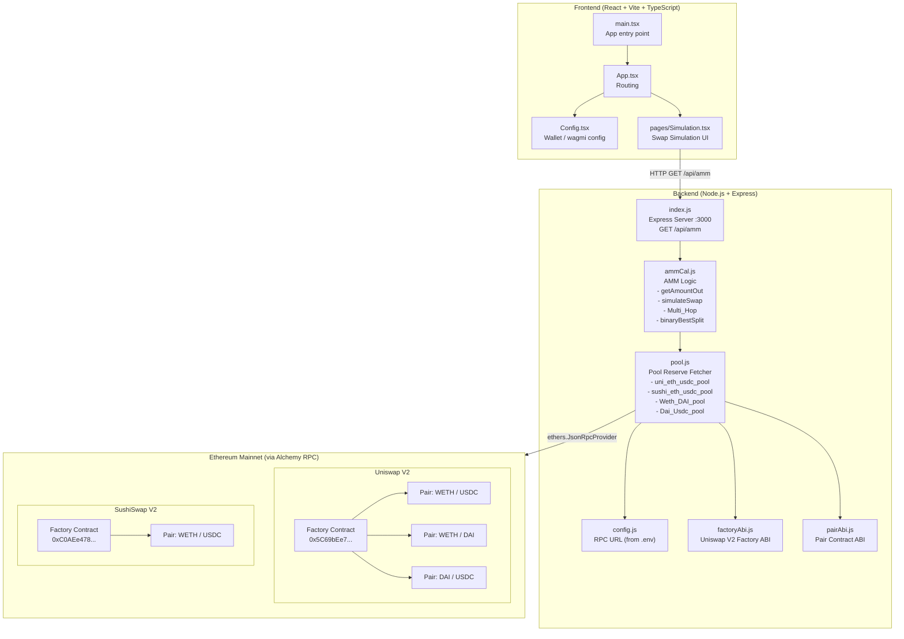

# AruDex — System Architecture

## Data Flow

1. **User** opens the React frontend (`Simulation.tsx`)
2. Frontend calls `GET http://localhost:3000/api/amm`
3. Express server (`index.js`) invokes `ammCalculation()` in `ammCal.js`
4. `ammCal.js` calls `pool.js` functions to fetch live on-chain reserves:
   - **Uniswap V2**: WETH/USDC, WETH/DAI, DAI/USDC pairs
   - **SushiSwap V2**: WETH/USDC pair
5. `pool.js` uses `ethers.js` with Alchemy RPC to query Factory → `getPair()` → `getReserves()`
6. `ammCal.js` runs:
   - **Single-hop swap** simulation (WETH → USDC on Uni & Sushi)
   - **Multi-hop routing** (WETH → DAI → USDC)
   - **Binary search split** to find optimal Uniswap vs SushiSwap allocation
   - **Slippage calculation**
7. Results returned as JSON to the frontend

## Key Algorithms

| Component | Algorithm |
|---|---|
| `getAmountOut` | Uniswap V2 constant product formula with 0.3% fee |
| `Multi_Hop` | Sequential AMM simulation across 2 pools |
| `binaryBestSplit` | Binary search over split ratio to maximise total USDC output |
| `simulateSwap` | Same as `getAmountOut` — used for liquidity-split comparison |
