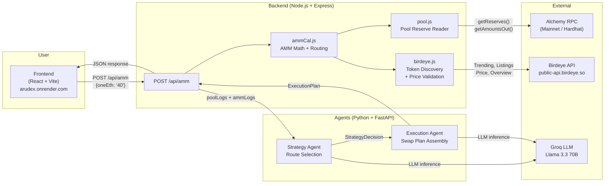

# AruDex – Intent-Based DEX Aggregator

> An intent-driven decentralized exchange aggregator that combines live on-chain liquidity data, Birdeye market intelligence, and AI-powered agent reasoning to recommend best-execution swaps across Uniswap V2 and SushiSwap.

**🌐 Live Demo:** [arudex.onrender.com](https://arudex.onrender.com)

---

## Highlights

- **Real-time pool data** — Reads WETH/USDC, WETH/DAI, and DAI/USDC reserves from both Uniswap V2 and SushiSwap factories directly on-chain.
- **Smart route optimization** — Simulates single-hop, split-liquidity, and multi-hop (WETH→DAI→USDC) routes with binary-search optimization to maximize output.
- **Birdeye intelligence layer** — Surfaces trending tokens and new listings via Birdeye API (`/defi/token_trending`, `/defi/v2/tokens/new_listing`, `/defi/token_overview`), applies quality filters (liquidity, volume, price stability), and validates pool-implied prices against Birdeye oracle pricing.
- **AI-powered strategy & execution** — A Strategy Agent selects the optimal routing venue; an Execution Agent assembles concrete swap steps with gas estimation, slippage guards, and path validation — all powered by Groq Llama 3.3 70B.
- **Dual-mode deployment** — Works seamlessly on both a local Hardhat fork (exact gas simulation) and Alchemy mainnet RPC (fallback gas estimation) with zero code changes.
- **React dashboard** — Ships a Vite + wagmi frontend with MetaMask wallet connection for inputting ETH amounts and inspecting recommended execution plans.

---

## Architecture



---

## Monorepo Layout

```
AruDex/
├── backend/                  # Express API, pool math, Birdeye integration, agent orchestration
│   ├── index.js              # API server + CORS + agent request forwarding
│   ├── ammCal.js             # AMM simulation, split optimization, arbitrage detection
│   ├── pool.js               # On-chain factory/pair reserve readers
│   ├── birdeye.js            # Birdeye API (discovery, price validation, rate limiting)
│   ├── config.js             # Environment config exports
│   ├── factoryAbi.js         # Uniswap V2 Factory ABI
│   └── pairAbi.js            # Pair contract ABI
├── Agents/                   # FastAPI service: /api/strategy + /api/execution
│   ├── app.py                # FastAPI server with CORS
│   ├── agents/
│   │   ├── Stratergy_agent.py  # Route selection via structured LLM output
│   │   └── Execution_agent.py  # Swap plan assembly with tool bindings
│   └── tools/                # LangChain tool definitions (swap, approve, gas)
├── Frontend/dex_frontend/    # React + Vite + wagmi client
│   └── src/
│       ├── App.tsx            # Wallet connection + app shell
│       ├── Config.tsx         # wagmi/viem configuration
│       └── pages/Simulation.tsx  # Swap simulation UI
├── contracts/                # Solidity contracts (Hardhat scaffolding)
├── hardhat.config.ts         # Mainnet fork at block 21,830,000
├── docker-compose.yml        # Full-stack local orchestration
├── ARCHITECTURE.md           # Detailed system diagram
└── Readme.md                 # ← You are here
```

---

## End-to-End Flow

1. **Frontend** — User enters an ETH amount → `POST /api/amm` to the backend
2. **Pool Data** — Backend reads live reserves from Uniswap V2 and SushiSwap contracts via RPC
3. **AMM Simulation** — Calculates swap outputs for single-hop, multi-hop, and split routes; checks slippage < 2%
4. **Birdeye Enrichment** — Fetches trending tokens + new listings, filters by quality thresholds, validates pool prices against Birdeye oracle
5. **Strategy Agent** — Receives `poolLogs` + `ammLogs` → deterministically selects `UNISWAP`, `SUSHISWAP`, `SPLIT`, `MULTI_HOP`, `ARBITRAGE`, or `NONE`
6. **Execution Agent** — Converts the strategy into concrete swap steps (`estimate_gas` → `swap_exact_eth_for_tokens`) with exact amounts and paths
7. **Response** — Full JSON with pool data, AMM analytics, Birdeye insights, strategy decision, and execution plan

---

## Birdeye API Integration

AruDex uses the [Birdeye Data API](https://bds.birdeye.so) for two purposes:

### Token Discovery
Surfaces high-quality trading candidates by combining:
- **`/defi/token_trending`** — Top trending tokens by rank
- **`/defi/v2/tokens/new_listing`** — Recently listed tokens
- **`/defi/token_overview`** — Detailed token metrics for enrichment

Candidates are filtered through configurable quality gates:
| Filter | Default | Env Var |
|--------|---------|---------|
| Min Liquidity | $250,000 | `BIRDEYE_MIN_LIQUIDITY_USD` |
| Min 24h Volume | $100,000 | `BIRDEYE_MIN_VOLUME_24H_USD` |
| Max Price Change | 80% | `BIRDEYE_MAX_ABS_PRICE_CHANGE_24H` |

### Price Validation
- **`/defi/price`** — Compares pool-derived ETH price against Birdeye oracle price
- Flags deviations above `BIRDEYE_PRICE_DEVIATION_THRESHOLD_PCT` (default 3%) as risk indicators
- Helps detect stale pools or potential manipulation

### Rate Limiting
Built-in retry logic with exponential backoff (1s → 2s → 4s) on 429 responses, plus sequential call spacing to stay within free-tier limits.

### Birdeye Endpoints Used
| Endpoint | Purpose |
|----------|---------|
| `GET /defi/token_trending` | Fetch trending tokens |
| `GET /defi/v2/tokens/new_listing` | Fetch new token listings |
| `GET /defi/token_overview` | Enrich candidate tokens |
| `GET /defi/price` | Oracle price for validation |

---

## Local Setup

### Prerequisites
- Node.js 20+
- Python 3.10+
- A free [Alchemy](https://alchemy.com) API key
- A free [Birdeye](https://bds.birdeye.so) API key
- A free [Groq](https://console.groq.com) API key

### 1. Clone & install dependencies

```bash
git clone https://github.com/Arunabha-Mukhopadhyay/AruDex.git
cd AruDex

npm install                                    # Root Hardhat deps
cd backend && npm install && cd -
cd Frontend/dex_frontend && npm install && cd -
cd Agents && python -m venv venv && source venv/bin/activate && pip install -r requirements.txt
```

### 2. Create environment files

```bash
# .env (repo root — for Hardhat)
ALCHEMY_RPC_URL=https://eth-mainnet.g.alchemy.com/v2/YOUR_KEY

# backend/.env
PROVIDER_URL=http://127.0.0.1:8545
STRATEGY_AGENT_URL=http://127.0.0.1:8000/api/strategy
EXECUTION_AGENT_URL=http://127.0.0.1:8000/api/execution
BIRDEYE_API_KEY=your-birdeye-key
BIRDEYE_CHAIN=ethereum
BIRDEYE_PRICE_DEVIATION_THRESHOLD_PCT=3
BIRDEYE_MIN_LIQUIDITY_USD=250000
BIRDEYE_MIN_VOLUME_24H_USD=100000
BIRDEYE_MAX_ABS_PRICE_CHANGE_24H=80

# Agents/.env
GROQ_API_KEY=your-groq-key
NODE_BACKEND_URL=http://127.0.0.1:3000

# Frontend/dex_frontend/.env
VITE_BACKEND_URL=http://localhost:3000
VITE_ALCHEMY_RPC_URL=http://127.0.0.1:8545
```

### 3. Start services

```bash
# Terminal 1 — Hardhat (forked mainnet)
npx hardhat node

# Terminal 2 — Agents
cd Agents && source venv/bin/activate
uvicorn app:app --host 0.0.0.0 --port 8000 --reload

# Terminal 3 — Backend
cd backend && node index.js

# Terminal 4 — Frontend
cd Frontend/dex_frontend && npm run dev
```

### 4. Test
Open `http://localhost:5173`, enter an ETH amount, click **Simulate**.

---

## Deployment (Render)

AruDex runs on Render as 3 services:

| Service | Type | URL |
|---------|------|-----|
| Frontend | Static Site | [arudex.onrender.com](https://arudex.onrender.com) |
| Backend | Web Service (Node.js) | [arudex-backend.onrender.com](https://arudex-backend.onrender.com) |
| Agents | Web Service (Python) | [arudex-agents.onrender.com](https://arudex-agents.onrender.com) |

In production, the backend connects to **Alchemy mainnet RPC** instead of Hardhat. Pool reserves and `getAmountsOut` are read-only calls that work directly on mainnet. Gas estimation gracefully falls back to standard values (150k gas) since the test wallet has no real ETH.

### Docker Compose (Alternative)

For full-stack local orchestration including Hardhat:

```bash
docker-compose up --build
```

This spins up all 4 services (Hardhat, Backend, Agents, Frontend) with proper networking.

---

## Key Algorithms

| Component | Algorithm | File |
|-----------|-----------|------|
| `simulateSwap` | Uniswap V2 constant product formula with 0.3% fee | `ammCal.js` |
| `binaryBestSplit` | Binary search over split ratio to maximize total USDC output | `ammCal.js` |
| `Multi_Hop` | Sequential AMM simulation across 2 pools (WETH→DAI→USDC) | `ammCal.js` |
| `Arbitrage_opp` | Cross-DEX circular arbitrage detection (Uni→Sushi, Sushi→Uni) | `ammCal.js` |
| `candidateScore` | Weighted scoring: 60% volume + 40% liquidity + momentum bonus | `birdeye.js` |
| `passesDiscoveryFilters` | Multi-threshold quality gate for token candidates | `birdeye.js` |

---

## Tech Stack

| Layer | Technology |
|-------|-----------|
| Frontend | React 18, Vite, TypeScript, wagmi, viem, TanStack Query |
| Backend | Node.js, Express 5, ethers.js v6 |
| Agents | Python 3.10, FastAPI, LangChain, LangGraph, Groq (Llama 3.3 70B) |
| Blockchain | Hardhat v3 (mainnet fork), Uniswap V2, SushiSwap V2 |
| Data | Birdeye API (token discovery + price validation) |
| Deployment | Render (static site + 2 web services) |

---

## License

MIT
